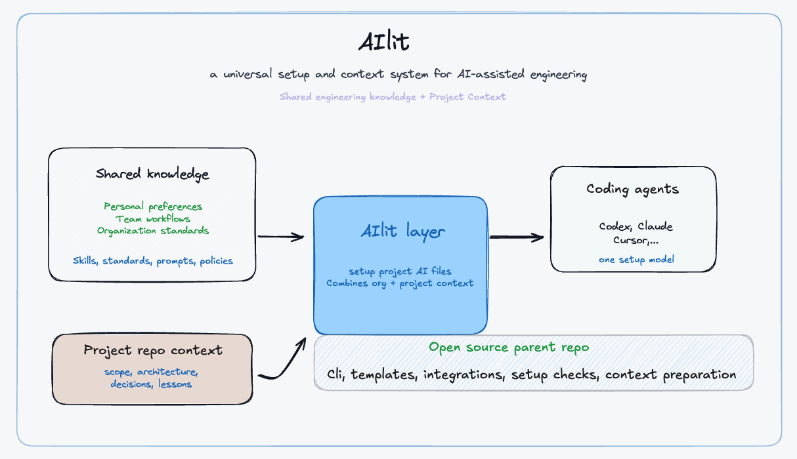

# AIlit

AIlit is an open-source setup and context runtime for AI-assisted engineering.

It helps developers use one shared local workflow across tools such as Codex, Cursor,
Claude Code, Gemini CLI, Antigravity, and Windsurf.



## Why This Exists

AI coding tools are useful, but they often start with too little project context.
That leads to repeated prompting, inconsistent output quality, and weak project memory.

AIlit adds a simple runtime layer that helps agents:

- load reusable engineering standards
- load relevant skills for the current task
- read project AI context from the target repository
- prepare a cleaner task context before non-trivial work

AIlit is not only a prompt builder.
Prompt preparation is one part of the system, but AIlit also handles:

- project onboarding
- skill discovery
- agent integration files
- project readiness checks
- reusable project memory

## Quick Start

Clone the repository:

```bash
git clone git@github.com:sundharesan11/ailit.git ~/engineering_brain
cd ~/engineering_brain
```

Install the global command:

```bash
~/engineering_brain/scripts/install_aios_command.sh
```

Check that it works:

```bash
which aios
aios --help
aios self-test
```

Onboard a project:

```bash
cd /path/to/project
aios onboard --project . --tools codex cursor claude gemini antigravity windsurf
aios doctor --project .
```

If you are still evaluating the project, these commands are enough to confirm that
the local runtime is installed and working.

## Documentation

Start here:

- [Overview](docs/overview.md)
- [Setup](docs/setup.md)
- [How To Use](docs/how_to_use.md)
- [Action Flow](docs/action_flow.md)
- [Skills](docs/skills.md)
- [Architecture](docs/architecture.md)
- [Troubleshooting](docs/troubleshooting.md)

## Common Use Cases

- set up a new project for AI-assisted development
- make sure coding agents use project context before editing
- manage reusable engineering skills in one place
- verify that installed skills are visible to AIOS
- keep project decisions and lessons easy to reuse

## How AIlit Fits With Codex And Claude

Tools like Codex and Claude Code already have native ways to load instructions.
For example, they can read local project instruction files such as `AGENTS.md`
or `CLAUDE.md`.

AIlit does not replace those systems.
Instead, it gives you one local workflow that can support multiple agent tools in
a consistent way.

## Current Status

AIlit is in active development. The repository already includes:

- a global `aios` command
- a project onboarding flow
- a project readiness checker
- a prompt preparation runtime
- a local and external skill registry
- integrations for major coding-agent tools

The interface and documentation will continue to improve as the runtime is tested
in real projects.

For the full explanation, use the docs linked above.
