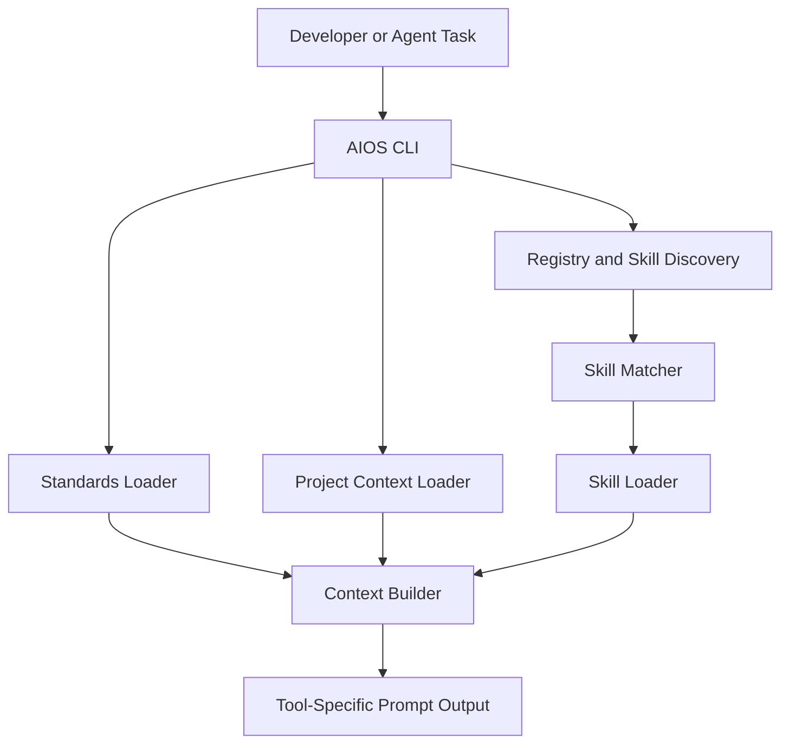
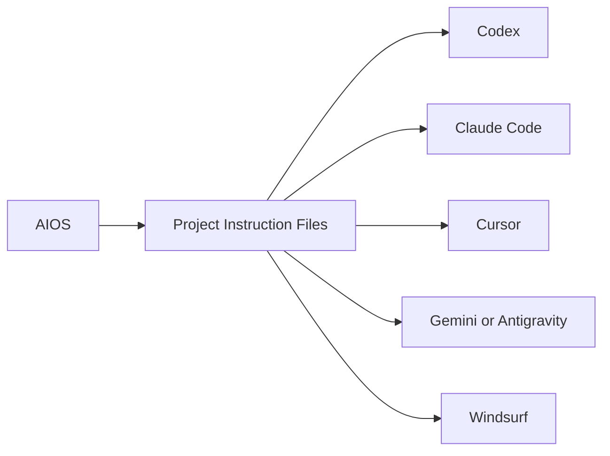

# Architecture

This document explains how AIOS is built.

The goal is simple: explain the system clearly enough that a junior developer can maintain it.

## First Principle

AIOS is not the coding agent itself.

It is the local runtime layer that helps a coding agent prepare for work.

That means AIOS sits between:

- the developer
- the coding tool
- the local project
- the reusable engineering knowledge

## High-Level View


AIOS has four main parts:

1. command layer
2. context-building runtime
3. skills and standards storage
4. project integration layer

Here is the simple flow:



There is also a tool bridge layer:



This is important because AIOS does not replace the tool's native instruction
system. It works through it.

## Main Folders

### `aios/`

This is the Python runtime package.

It contains the logic for:

- commands
- registry building
- skill matching
- skill loading
- project onboarding
- readiness checks
- prompt preparation

### `skills/`

This is the local AIOS skill library.

Each skill normally has:

- `metadata.json`
- `skill.md`
- optional supporting files such as `examples.md`

### `standards/`

This stores reusable engineering principles such as:

- simplicity
- clean architecture
- test-driven development

### `registry/`

This stores generated registry files.

The main one is:

```text
registry/skills.json
```

It is built from:

- local AIOS skills
- installed external skills
- imported vendor skills

### `integrations/`

This contains the templates and guidance for supported AI tools.

These templates are the bridge between AIOS and the native instruction model of
each tool.

### `scripts/`

This contains command wrappers and small utilities.

Examples:

- `scripts/aios.py`
- `scripts/install_aios_command.sh`

## Important Runtime Modules

### `aios/cli.py`

This is the main command entry point.

It defines commands such as:

- `aios onboard`
- `aios doctor`
- `aios prepare`
- `aios list-skills`

### `aios/registry.py`

This builds the skill registry.

It collects skills from:

- `~/engineering_brain/skills`
- `~/.agents/skills`
- `~/.codex/skills`

It also supports overriding external roots with:

```text
AIOS_SKILL_SOURCES
```

### `aios/matcher.py`

This matches a user task to likely skills.

It scores skills using things like:

- skill name
- title
- description
- tags
- aliases
- keywords

### `aios/loader.py`

This loads the content of selected skills.

It supports:

- local AIOS skills
- external installed skills
- imported vendor skills

### `aios/context_builder.py`

This combines:

- standards
- selected skills
- project AI files
- the current user task

into one task-ready context block.

### `aios/prepare.py`

This is the runtime wrapper used before real work.

It:

1. runs `doctor`
2. collects warnings
3. builds the task context
4. returns a tool-specific prompt block

This is the part that feels most like a prompt builder.
But it depends on the rest of the system being in place.

### `aios/doctor.py`

This checks whether a project is ready for AI-assisted development.

It looks for:

- the `ai/` directory
- expected AI files
- agent instruction files
- a valid registry
- valid skills

### `aios/onboard.py`

This is the one-command project setup flow.

It:

1. creates project AI files
2. detects project context
3. installs tool integrations
4. runs readiness checks

## How The Skill Registry Works

The registry is a generated file.
It is not meant to be edited by hand.

AIOS builds it from multiple sources:

### Local skills

These live in:

```text
~/engineering_brain/skills/
```

These are native AIOS skills.

### Installed external skills

These are discovered automatically from:

```text
~/.agents/skills/
~/.codex/skills/
```

These are turned into normalized registry entries so AIOS can match and load them.

### Imported vendor skills

These are copied into the AIOS repository with commands such as:

```bash
aios import-skill --source ./some_skill
```

## How Tool Integration Works

AIOS writes instruction files into a target project.

Common files include:

- `AGENTS.md`
- `CLAUDE.md`
- `GEMINI.md`
- `.cursor/rules/ai-os.mdc`
- `.windsurf/rules/ai-os.md`

These files tell the coding agent to run:

```bash
aios prepare --task "..." --project . --tool <tool>
```

before non-trivial work.

This is the main connection point with tools such as Codex and Claude Code.

Those tools already support project instructions in their own way.
AIOS uses that existing mechanism and gives them one shared local runtime
command to call.

That is why AIOS should be understood as a cross-tool runtime layer, not only
as a prompt formatting tool.

## What Is Generated And What Is Source Code

### Source code

These are hand-maintained:

- `aios/*.py`
- `skills/`
- `standards/`
- `integrations/`
- docs

### Generated data

These are rebuilt by commands:

- `registry/skills.json`
- plugin/provider registries

## Safe Mental Model

If you are maintaining AIOS, use this mental model:

- `cli.py` defines the commands
- `registry.py` decides what skills exist
- `matcher.py` decides which skills fit a task
- `loader.py` loads skill content
- `context_builder.py` assembles prompt parts
- `prepare.py` gives the final task-ready output
- `integrations.py` is the bridge to the agent tools

If you keep those responsibilities clear, the system stays understandable.
