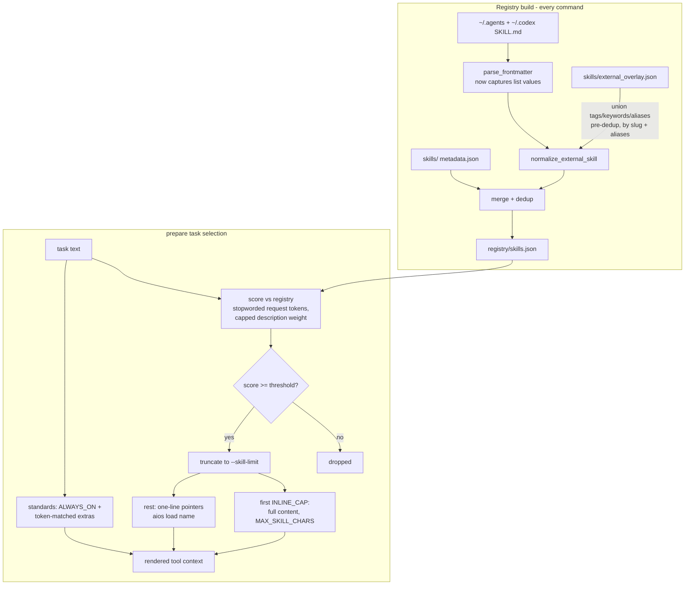

# fix: Matcher relevance, prepare output diet, and readiness hygiene

## Summary

Make `aios prepare` hand agents genuinely relevant, right-sized context before the first real pilot: overhaul skill-match scoring with a relevance threshold across local and installed external skills, enrich external skills' matchability via frontmatter list parsing plus a curated overlay (without touching files under `~/.agents` or `~/.codex`), slim the prepare output to threshold-gated inlining with load-on-demand pointers and relevance-selected standards, close the frontend coverage gap with a small local skill family, wire a deterministic matcher eval into `aios self-test`, and fix the generated-template command hygiene.

---

## Problem Frame

A readiness inspection before the personal-website pilot found that the runtime plumbing is solid (self-test 29/29) but the context quality — the system's whole point — is not. For the task "build the hero section and projects grid for my personal portfolio website using Next.js and Tailwind", the matcher selected `ce_slack_research`, `ce_debug`, `ce_sessions`, `git_commit_push_pr`, and `learnings_researcher` while missing `ui_ux_design` and `frontend_design`, which exist in the registry. One `prepare` call emitted ~52KB: all three standards unconditionally plus five mismatched skills inlined at full length.

Root causes confirmed in code:

- `aios/matcher.py` scores every request-token hit in a skill description at +1 with no stopwords, no length normalization, and no minimum score — 151 external skills with paragraph-long trigger descriptions dominate on common words, and the top 5 are always returned.
- `aios/registry.py` `parse_frontmatter()` handles only `key: value` lines, so YAML list values (`tags:`, `keywords:`) in external `SKILL.md` files are silently dropped; external entries get noise tags tokenized from their names and always-empty `keywords`.
- `aios/standards.py` loads all of `standards/*.md` unconditionally; `aios/loader.py` inlines full untruncated skill entrypoints (external `SKILL.md` files run 3–45KB) while solutions already have a truncation precedent (`MAX_SOLUTION_CHARS = 2200`).
- The generated `AGENTS.md` template hardcodes `python3 ~/engineering_brain/scripts/aios.py` instead of the installed `aios` command, and `aios/doctor.py` checks for the literal substring `aios.py prepare`.

---

## Requirements

**Matching relevance**

- R1. Realistic web/frontend task phrasings (e.g., "build the hero section and projects grid for my portfolio website using Next.js and Tailwind") match relevant skills across both local skills and installed external skills.
- R2. Skills with no genuine relevance fall below a minimum score threshold and are excluded — `match`, `build`, and `prepare` return fewer (or zero) skills rather than top-5-always.
- R3. Verbose descriptions and common words no longer dominate scoring: request-side stopword filtering and a capped description contribution, with scores remaining integral.
- R4. Solution matching shares the same scoring primitives as skill matching so the two cannot silently drift.

**External skill enrichment**

- R5. YAML list values (`tags:`, `keywords:`) in external `SKILL.md` frontmatter are captured at index time; nested maps (e.g., a `hooks:` block) never pollute metadata.
- R6. A hand-maintained overlay file adds tags/keywords/aliases to named external skills at index time; files under `~/.agents/skills` and `~/.codex/skills` are never modified.
- R7. A missing overlay file is a silent no-op; a malformed one warns on stderr and continues — it never breaks a command. Overlay keys that match zero installed skills are reported so the overlay cannot rot invisibly.

**Prepare output diet**

- R8. Only above-threshold matches are considered; at most a small inline cap get full content, and remaining above-threshold matches render as one-line pointers naming the canonical skill name and `aios load <name>`. Below-threshold skills are dropped entirely.
- R9. Inlined skill content truncates at a character cap with a visible pointer tail to the full content, mirroring the existing solution truncation.
- R10. Standards are relevance-selected with an always-on baseline; output never contains zero standards.
- R11. `prepare` runs the match-and-assemble pipeline once per invocation (doctor's context-builder smoke test is skipped when doctor runs inside prepare), and the audit log records the inline-versus-pointer split.

**Coverage**

- R12. A local frontend skill family covers web-build concerns the installed external skills do not (accessibility, responsive layout, web performance), with metadata tuned for matching.

**Hygiene**

- R13. Generated integration templates invoke the installed `aios` command, with the `python3` wrapper path retained as a documented fallback; doctor accepts both the old and new command forms so already-onboarded projects keep passing, and warns when `aios` is not on PATH.
- R14. Hand-maintained doc copies of the templates are updated in lockstep, and the design-harness ideation doc is tracked in version control.

**Verification**

- R15. A deterministic matcher eval set runs inside `aios self-test`, reproducing the original failure mode (verbose-description distractor vs. correct skill) with relative assertions that do not depend on which real skills happen to be installed.

---

## Key Technical Decisions

- **Heuristic scoring only this pass.** Improved keyword scoring (stopwords, weight rebalance, threshold) — no embeddings or LLM re-ranking. Semantic matching is deferred until the eval set shows heuristics are insufficient.
- **Selection pipeline order is pinned:** trust filter → score → threshold filter → truncate to `--skill-limit` (0 = unlimited) → inline the first `min(INLINE_CAP, limit)` → pointers for the rest. Below-threshold matches vanish; pointers are only for above-threshold matches beyond the inline cap. `--skill-limit` keeps meaning "total matches considered" — help text documents the new behavior.
- **Scores stay integral.** Description contribution is capped at a small fixed integer total (e.g., +3) per skill rather than length-normalized division. Both matchers sort with `-int(score)`; fractional scores would silently reorder via int truncation (`aios/matcher.py`, `aios/solution_matcher.py`).
- **Stopwords filter request tokens only — never skill-side tag/keyword sets.** Tempting stopwords ("design", "build", "page") are exactly the tokens overlay entries and skill names rely on; filtering only the request side preserves them. The eval set proves "build a landing page" still matches the UI/UX fixture.
- **Overlay merges pre-dedup inside `normalize_external_skill()`,** keyed by slugified skill name and also matched against raw aliases. Provider-duplicated skills (real today: `find-skills`, `remotion-best-practices` exist in both `~/.agents` and `~/.codex`) both receive the overlay before `ensure_unique_skill_names()` renames one; merging post-dedup would silently miss renamed copies. The registry regenerates on nearly every command (`load_registry(refresh=True)` is the default), so enrichment must live in the build path, not in `registry/skills.json` edits.
- **Overlay file lives at `skills/external_overlay.json`.** `registry/` is documented as generated-do-not-hand-edit; `skills/` is the hand-maintained domain. Schema: object keyed by slugified skill name, values with optional `tags`/`keywords`/`aliases` string lists; merge is set-union with existing values.
- **Overlay aliases are matching-only.** `aios load` resolves canonical post-dedup names only; pointer lines always print canonical names so agents never hit alias dead-ends.
- **Eval assertions are relative, not absolute-rank.** "Correct fixture ranks above distractor fixture" and "distractor scores below threshold" — never "fixture is rank 1", because local `skills/` always participates in matching (`SKILLS_DIR` has no env override) and absolute ranks would break whenever local skills change. Fixture external skills are injected via the existing `AIOS_SKILL_SOURCES` override pattern (`aios/self_test.py`).
- **Standards selection: hardcoded always-on baseline plus token matching.** An `ALWAYS_ON` tuple (the simplicity standard) is always included; other standards gain lightweight frontmatter (`tags:`) and are selected by token match against the task. Zero matches → baseline only. The already-present but unconsumed `recommended_standards` field in skill metadata is additionally honored when present on selected skills.
- **Doctor accepts both command forms indefinitely.** The contract check matches `aios prepare` or `aios.py prepare` — neither is a substring of the other, and switching strictly would flip every already-onboarded project to WARN, polluting agent context on every prepare. `scripts/aios.py` stays supported as the fallback invocation.
- **Skill truncation mirrors the solution precedent.** A `MAX_SKILL_CHARS` cap in the loader with a truncation marker plus a `Full content: aios load <name>` tail, following `MAX_SOLUTION_CHARS` in `aios/solution_loader.py`.
- **Shared scoring primitives live in `aios/matcher.py`** (tokenize, stopwords, scoring helpers) and `aios/solution_matcher.py` imports them. The two files are near-clones that have already drifted (tokenize handles `-` differently); full duplication is the repo's convention only for small helpers, which a scorer no longer is. Threshold values may differ per matcher (solution summaries are short; skill descriptions are the verbose offenders).

---

## High-Level Technical Design

The two changed flows — registry build with enrichment, and prepare's selection pipeline:

---

## Implementation Units

### U1. Frontmatter list parsing in the registry

- **Goal:** External `SKILL.md` frontmatter list values become usable metadata instead of being silently dropped.
- **Requirements:** R5
- **Dependencies:** none
- **Files:** `aios/registry.py`, `aios/self_test.py`
- **Approach:** Extend `parse_frontmatter()` to consume block-style lists (`tags:` followed by indented `- item` lines) and flow-style lists (`tags: [a, b]`), returning `dict[str, str | list[str]]`. Only indented lines starting with `- ` are consumed as list items; any other indented content (nested maps like the `hooks:` block in the installed ui-ux-design skill) bails to skip mode, preserving current behavior. Comma-separated scalars (`allowed-tools: Read, Write`) stay strings. `normalize_external_skill()` coerces non-list fields (`description`, `version`) to strings defensively and unions parsed `tags`/`keywords` into the entry's fields.
- **Patterns to follow:** existing minimal hand-rolled parser style in `aios/registry.py`; module conventions (type hints, one-line docstrings, pure functions).
- **Test scenarios** (as `run_step` additions following the `AIOS_SKILL_SOURCES` fixture pattern):
  - Fixture `SKILL.md` with a block-style `tags:` list → tags appear in the registry entry.
  - Fixture with flow-style `keywords: [a, b]` → keywords captured.
  - Fixture with a nested `hooks:` map → no garbage tags; entry parses cleanly (regression for the installed ui-ux-design shape).
  - Fixture with `description:` accidentally written as a list → coerced to string, no crash.
  - Fixture with comma-separated scalar value → remains a single string.
- **Verification:** `aios self-test` passes including the new parser steps; `aios list-skills` output unchanged for skills without list frontmatter.

### U2. Curated external-skill overlay

- **Goal:** Named external skills become findable for web/portfolio tasks without editing their files.
- **Requirements:** R6, R7
- **Dependencies:** U1
- **Files:** `skills/external_overlay.json` (new), `aios/registry.py`, `aios/cli.py`, `aios/doctor.py`, `docs/skills.md`, `aios/self_test.py`
- **Approach:** Load the overlay inside the registry build and merge per-skill inside `normalize_external_skill()` (pre-dedup), keyed by slugified name with fallback matching against raw aliases. Missing file → no-op; invalid JSON or schema violation (value not a dict, list field not a list of strings) → one stderr warning, continue without overlay. Track which overlay keys matched during a build and surface unmatched keys in `aios doctor` and `aios list-skill-sources` output. Seed the overlay with web-relevant entries (e.g., `ui_ux_design`, `frontend_design`, `seo_audit`, `page_cro`, `stitch_ui_design`) carrying terms like `website`, `portfolio`, `landing`, `hero`, `frontend`, `nextjs`, `tailwind`, `responsive`. Document the schema and workflow in `docs/skills.md`.
- **Patterns to follow:** JSON written/read with the repo's `indent=2, ensure_ascii=False` conventions; warning style of existing actionable error messages.
- **Test scenarios:**
  - Overlay entry for a fixture external skill → merged tags/keywords visible in registry entry and matchable.
  - Overlay key matching no installed skill → build succeeds; key reported as unmatched.
  - Malformed overlay JSON → command still succeeds; warning emitted; no overlay applied.
  - Two fixture providers exposing the same skill name → both copies receive the overlay; dedup rename still occurs.
- **Verification:** with the seeded overlay, `aios match "build a landing page for my portfolio"` ranks an overlay-enriched UI/frontend skill at the top against the live registry.

### U3. Matcher eval harness in self-test

- **Goal:** A deterministic regression eval encodes the relevance contract before the scorer changes.
- **Requirements:** R15
- **Dependencies:** U1, U2 (fixtures exercise list frontmatter and overlay paths)
- **Execution note:** Eval-first — land the harness with cases that fail against the current scorer; U4 makes them pass. U3 and U4 merge together so `self-test` is green at the end of the sequence.
- **Files:** `aios/match_eval.py` (new), `aios/self_test.py`
- **Approach:** A small module holding fixture external-skill definitions (written to a temp source root via the existing `AIOS_SKILL_SOURCES` override) and eval cases of task → expectations. Fixtures reproduce the observed failure mode: a "correct" skill shaped like ui-ux-design (relevant name/tags, short description) versus "distractor" skills shaped like the verbose ce-* skills (long trigger-list descriptions full of common words). Assertions are relative: correct ranks above distractor; distractor falls below the match threshold; "build a landing page" still matches the UI fixture after stopwording; an overlay-driven case where the overlay is what makes the correct skill win. Also fix the existing fragile step (`match_skills(...)[0]` at `aios/self_test.py`) to handle empty results.
- **Patterns to follow:** `run_step` + `SelfTestResult` structure; temp-root setup/teardown and registry self-healing reindex from the existing external-skill steps in `aios/self_test.py`.
- **Test scenarios:** the eval cases are the tests; include at least — portfolio/hero task → UI fixture above all distractors; an off-domain task ("set up kafka consumer retries") → web fixtures below threshold; a task matching nothing → empty result handled without exception.
- **Verification:** before U4, the new steps FAIL demonstrating the bug; after U4, full `aios self-test` passes; a code comment notes the live `registry/skills.json` is temporarily rewritten during eval (existing self-test behavior, self-heals on next refresh).

### U4. Matcher scoring overhaul

- **Goal:** Realistic tasks select relevant skills; irrelevant skills return no match.
- **Requirements:** R1, R2, R3, R4
- **Dependencies:** U3
- **Files:** `aios/matcher.py`, `aios/solution_matcher.py`, `aios/cli.py`, `aios/self_test.py`
- **Approach:** Add a request-side `STOPWORDS` set (articles, pronouns, generic verbs like "use", "make", "add" — chosen against the eval set so domain terms survive); rebalance weights keeping name/tags/keywords/aliases dominant; cap total description contribution at a small integer; introduce `MIN_MATCH_SCORE` filtering in `match_skills()`. Extract shared primitives (tokenize, stopword filter, field scoring) used by both matchers; `solution_matcher.py` imports them and applies its own threshold. Update `aios match --help` to state that results below the relevance threshold are omitted.
- **Patterns to follow:** module-level UPPER_SNAKE constants near the top; pure scoring functions; existing CLI handler shape in `aios/cli.py`.
- **Test scenarios:** covered by the U3 eval set, plus — solution matching still selects the self-test retry solution (existing `prepare with solutions` step); exact skill-name request still hits the +20 phrase bonus; tag/keyword hits on overlay terms outrank description-only hits.
- **Verification:** `aios self-test` fully green including eval steps; manual spot-check `aios match` on the original portfolio task returns relevant skills only.

### U5. Prepare output diet — skills

- **Goal:** Prepare emits focused context: few full skills, pointers for the rest, no double pipeline run.
- **Requirements:** R8, R9, R11
- **Dependencies:** U4
- **Files:** `aios/context_builder.py`, `aios/loader.py`, `aios/prepare.py`, `aios/doctor.py`, `aios/adapters.py`, `aios/cli.py`, `aios/self_test.py`
- **Approach:** Implement the pinned pipeline (threshold → limit → inline cap → pointers) in `context_builder.py`. Add `MAX_SKILL_CHARS` truncation in `loader.py` with a truncation marker and `Full content: aios load <name>` tail (mirror `truncate_text` in `aios/solution_loader.py`). Pointer lines carry canonical name + one-line description + `aios load <name>`. Give `run_doctor()` an option to skip the context-builder smoke test and use it from `prepare` (the real `build_context_parts` call proves the same thing); reduce redundant registry refreshes within a single prepare invocation where straightforward (reuse a loaded registry rather than `refresh=True` per call). Friendlier `aios load` error when a previously-pointed skill is no longer installed. Extend `append_prepare_audit` to log inline and pointer counts (e.g., `skills=ui_ux_design,+3ptr`). Document the changed semantics in `prepare --help`.
- **Patterns to follow:** solution truncation precedent in `aios/solution_loader.py`; existing section rendering in `aios/adapters.py` (`render_universal`).
- **Test scenarios:**
  - Task with several above-threshold matches → first `INLINE_CAP` inlined (truncated), the rest rendered as pointer lines naming `aios load`.
  - Task with zero above-threshold matches → existing "No matching skills found" fallback; no pointers; exit 0.
  - `--skill-limit 1` (used by doctor smoke and self-test) → one inline, zero pointers, no error.
  - Oversized fixture skill (> `MAX_SKILL_CHARS`) → truncated with marker and pointer tail.
  - Prepare audit line records the inline/pointer split.
  - `aios load` of an uninstalled skill name → actionable message, not a raw traceback.
- **Verification:** prepare output for the portfolio task drops by an order of magnitude versus the ~52KB baseline while still containing the relevant skill; `aios self-test` green.

### U6. Prepare output diet — standards selection

- **Goal:** Standards load by relevance with an always-on baseline instead of all-of-directory.
- **Requirements:** R10
- **Dependencies:** U4 (shares scoring primitives)
- **Files:** `aios/standards.py`, `standards/clean_architecture.md`, `standards/tdd.md`, `standards/simplicity.md`, `aios/context_builder.py`, `aios/self_test.py`, `docs/how_to_use.md`
- **Approach:** Add lightweight frontmatter (`tags:`) to standards files; `load_standards(task=None)` keeps current behavior with no task, and with a task returns `ALWAYS_ON` (simplicity) plus token-matched extras, honoring `recommended_standards` from selected skills when present. Strip the frontmatter block when rendering standards content (mirror `strip_frontmatter` in `aios/solution_loader.py`) so rendered output never embeds raw YAML. `build_context_parts` passes the task through. Doctor's smoke text changes are acceptable; the smoke test is skipped from prepare after U5 anyway.
- **Patterns to follow:** frontmatter parsing from U1; glob-and-concat structure of `aios/standards.py`.
- **Test scenarios:**
  - Frontend task → simplicity always present; TDD/clean-architecture included only on token match.
  - Task matching no standards → baseline-only output, never empty.
  - No-task call path (`aios build` without task-aware callers) → all standards, unchanged behavior.
  - Rendered standards output contains no raw `---` frontmatter lines.
- **Verification:** prepare for the portfolio task no longer lectures TDD + clean architecture by default; `aios self-test` green.

### U7. Local frontend skill family

- **Goal:** Close web-build coverage gaps the installed external skills don't address.
- **Requirements:** R12
- **Dependencies:** U4 (matchability verified against new scorer)
- **Files:** `skills/frontend/accessibility_basics/{metadata.json,skill.md,examples.md}`, `skills/frontend/responsive_layout/{metadata.json,skill.md,examples.md}`, `skills/frontend/web_performance/{metadata.json,skill.md,examples.md}`
- **Approach:** Author three concise local skills following the existing local skill shape (`skills/backend/retry_strategy/` as the model): purpose, principles, agent instructions, review checklist, pitfalls. Metadata `tags`/`keywords` tuned for web tasks (`accessibility`, `a11y`, `responsive`, `breakpoints`, `performance`, `lighthouse`, `core web vitals`, `website`, `frontend`). Skip concerns already well covered externally (visual design → `ui_ux_design`/`frontend_design`; SEO → `seo_audit`).
- **Patterns to follow:** local skill format and validator requirements (`registry.validate_skill()` required fields, `entrypoint == "skill.md"`).
- **Test scenarios:** `aios validate` passes for the new skills; `aios match "make the site accessible"` and `aios match "improve page load performance"` surface the corresponding new skill above threshold.
- **Verification:** `aios self-test` skill validation step green; new skills appear in `aios list-skills` as `source=local`.

### U8. Template and doctor hygiene

- **Goal:** Generated instructions invoke `aios` correctly everywhere without breaking existing projects.
- **Requirements:** R13, R14
- **Dependencies:** none (can land any time)
- **Files:** `aios/integrations.py`, `aios/doctor.py`, `integrations/universal_agent_runtime.md`, `integrations/claude.md`, `integrations/codex.md`, `integrations/cursor.md`, `integrations/gemini.md`, `integrations/antigravity.md`, `integrations/windsurf.md`, `integrations/README.md`, `docs/architecture.md`, `plugins/README.md`, `updates/README.md`, `docs/ideation/design-oriented-build-harness.md`
- **Approach:** Replace the five hardcoded `python3 ~/engineering_brain/scripts/aios.py` occurrences in the template constants with `aios`, adding one fallback line ("if `aios` is not on PATH, use `python3 ~/engineering_brain/scripts/aios.py`"). Doctor's AGENTS.md contract check accepts either `aios prepare` or `aios.py prepare`. Add a doctor check warning when `aios` is not resolvable on PATH (`shutil.which`), pointing at `scripts/install_aios_command.sh`. Update the hand-maintained doc copies in `integrations/` and the other referencing docs in the same change so they don't drift. Track the design-harness ideation doc in version control.
- **Patterns to follow:** `DoctorCheck` dataclass and check style in `aios/doctor.py`; `IntegrationResult` flow in `aios/integrations.py`.
- **Test scenarios:**
  - Fresh onboard → generated AGENTS.md contains `aios prepare`; doctor PASSes the contract check.
  - Legacy project AGENTS.md containing only `aios.py prepare` → doctor still PASSes (no new WARN injected into prepare output).
  - `aios` absent from PATH (simulated) → doctor WARNs with install hint; nothing crashes.
- **Verification:** `aios onboard` + `aios doctor` on a scratch project show no contract warnings under either template generation; existing self-test integration steps stay green.

---

## Scope Boundaries

**Deferred to follow-up work**

- Semantic or embedding-based skill matching, and LLM re-ranking — revisit only if the eval set shows heuristics plateauing.
- The design-oriented build harness (`design-plan` / `design-prompts` / `design-synthesize`) — its ideation doc is committed here (U8) but implementation waits for real pilot data, per the doc's own recommendation.
- The personal-website pilot itself — this plan is the pre-flight.
- An env override for the local `skills/` directory (`SKILLS_DIR` indirection) — relative eval assertions remove the need this pass.
- Making overlay aliases resolvable by `aios load` — aliases stay matching-only.
- Consolidating the per-process registry refresh into full memoization — U5 only removes the easy redundant refreshes inside prepare.

---

## Risks

- **Threshold tuning.** Too high silently drops relevant skills; too low re-admits noise. Mitigation: the eval set is the contract — tune `MIN_MATCH_SCORE` and weights against it, and grow it with misses found during the pilot.
- **Stopword overreach.** A stopword like "design" or "page" could break the very matches the overlay creates. Mitigation: stopwords apply to request tokens only, and the eval includes the "build a landing page" case.
- **Behavior change for `--skill-limit` users.** The flag's meaning shifts from "5 full skills always" to "matches considered after threshold". Mitigation: help-text documentation; doctor/self-test call sites updated in U5.
- **Hand-maintained doc drift.** The `integrations/*.md` copies of templates have no sync mechanism; U8 updates them but future template edits can drift again. Accepted for now; noted in `docs/architecture.md`.
- **Self-test rewrites the live registry during eval.** Existing pattern — a concurrent `aios prepare` in another terminal during self-test sees fixture state until the next refresh self-heals. Accepted; documented with a code comment.

---

## Sources & Research

- `aios/matcher.py` — weights (+20 phrase, +6 name, +5 tags/aliases, +4 keywords, +3 title, +1 description token), `score > 0` as the only filter, `-int(score)` sort.
- `aios/registry.py` — `DEFAULT_EXTERNAL_SKILL_SOURCE_PATHS`, `parse_frontmatter()` (scalar-only), `normalize_external_skill()` (hardcoded `trust_level="reviewed"`, noise tags from name tokens, empty keywords), two-stage `ensure_unique_skill_names()` dedup, `load_registry(refresh=True)` default.
- `aios/solution_loader.py` — `MAX_SOLUTION_CHARS = 2200` truncation precedent; `aios/solution_matcher.py` — drifted near-clone of the matcher.
- `aios/prepare.py` / `aios/doctor.py` — doctor runs a full `build_context` smoke inside every prepare; `doctor.py` AGENTS.md substring check (`aios.py prepare`); note `aios prepare` and `aios.py prepare` are not substrings of each other.
- `aios/self_test.py` — `run_step` pattern, `AIOS_SKILL_SOURCES` fixture override, fragile `match_skills(...)[0]` step.
- `aios/integrations.py` — five template constants embedding the wrapper path; `scripts/install_aios_command.sh` symlinks `~/.local/bin/aios` to `scripts/aios.py`.
- Observed failure: `prepare --task "build the hero section and projects grid for my personal portfolio website using Next.js and Tailwind"` → selected `ce_slack_research`, `ce_debug`, `ce_sessions`, `git_commit_push_pr`, `learnings_researcher`; ~52KB / ~1,200 lines output.
- Live external corpus check: almost no installed `SKILL.md` carries `tags:`/`keywords:` frontmatter today — the overlay (U2) carries most of the enrichment value; the parser fix (U1) is forward-compatibility plus safety around nested maps.
